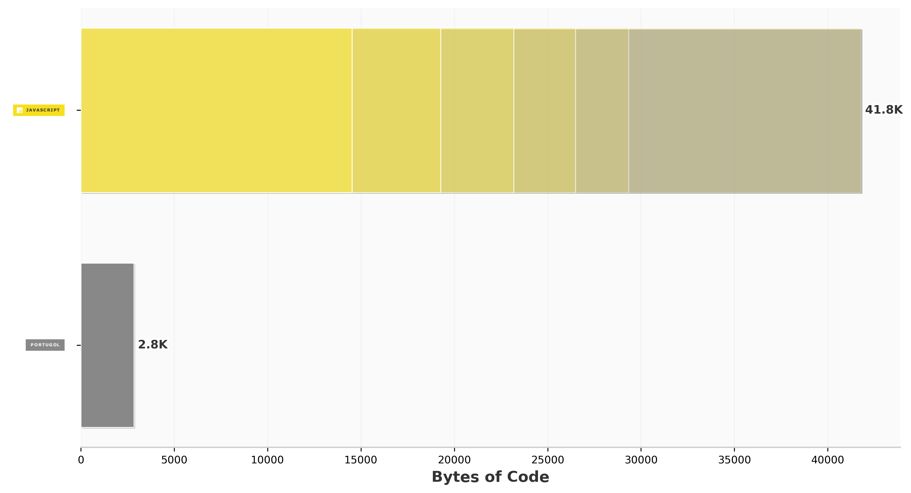
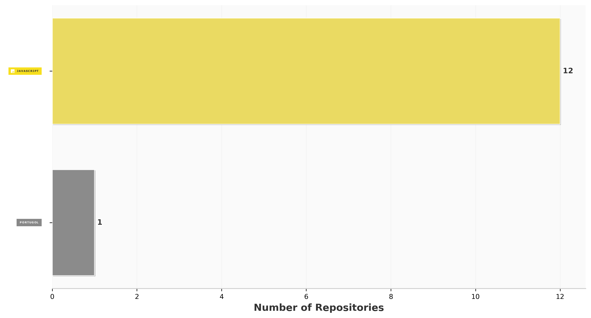
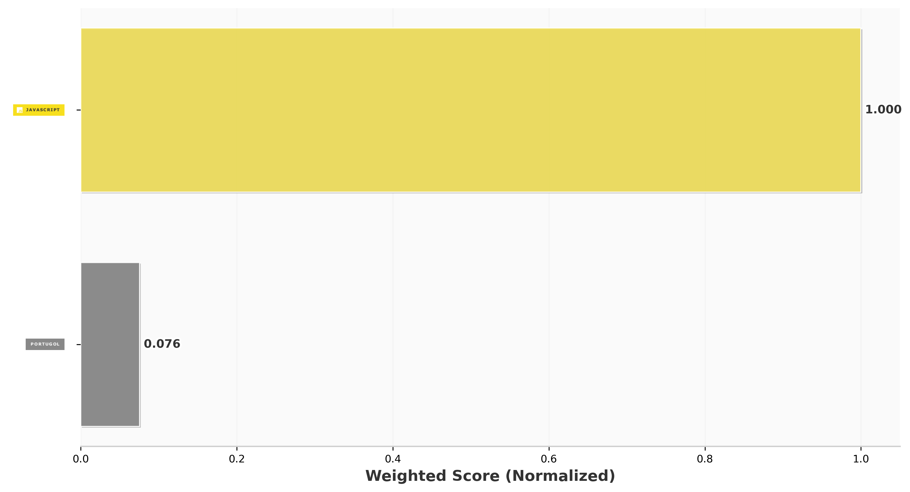

# 🚀 Trabalho de Conclusão da Disciplina – Integração Contínua com GitHub Actions

# 🎯 Objetivo

Desenvolver uma pipeline de integração contínua utilizando GitHub Actions para um projeto com testes automatizados, contemplando:

* Execução por push;
* Execução manual;
* Execução agendada (schedule);
* Geração de relatório de testes;
* Armazenamento/publicação do relatório na pipeline;
* Criação de documentação explicando a solução e os conceitos utilizados.

Preferencialmente utilizar um projeto desenvolvido em outra disciplina da pós-graduação.
---

# 📋 Requisitos

* Trabalho individual;
* Utilização do GitHub Actions;
* Pipeline executando com sucesso;
* Testes automatizados executando com sucesso;
* Relatórios gerados e armazenados na pipeline;
* Aplicação dos conceitos de Integração Contínua;
* Uso adequado das ferramentas propostas;
* Documentação completa através deste README.

---

# 📦 Entrega

Conforme solicitado na atividade, a entrega é composta por:

* URL do repositório GitHub contendo a solução implementada;
* Evidência de pelo menos uma execução bem-sucedida da pipeline.

**Prazo de entrega:** 21/06 às 23h59.

---

# 🛠️ Tecnologias Utilizadas

* Node.js
* JavaScript (ES Modules)
* Git
* GitHub
* GitHub Actions
* Mocha
* Chai
* ESLint
* Mochawesome
* NYC

---

## 📂 Estrutura do Projeto
.
├── .github/
│   └── workflows/
│       └── pipeline.yaml          # Pipeline de Integração Contínua
│
├── coverage/                      # Relatórios de cobertura gerados pelo NYC
│
├── reports/                       # Relatórios gerados pelo Mochawesome
│   ├── assets/
│   ├── test-report.html
│   └── test-report.json
│
├── src/
│   └── ServicoDePagamentoBancario.js
│                                 # Código-fonte da aplicação
│
├── stats/                         # Estatísticas de linguagens do repositório
│   ├── leaderboard_by_bytes.png
│   ├── leaderboard_by_repos.png
│   └── leaderboard_by_weighted.png
│
├── test/
│   └── ServicoDePagamentoBancario.test.js
│                                 # Testes automatizados
│
├── .gitignore                     # Arquivos ignorados pelo Git
├── eslint.config.js               # Configuração do ESLint
├── package.json                   # Dependências e scripts do projeto
├── package-lock.json              # Controle de versões das dependências
└── README.md                      # Documentação do projeto
---

# ⚙️ Instalação

## Clonar o Repositório

```bash
git clone https://github.com/Wedney18/PGATS-2026-03-integracao-continua-trabalho-de-conclusao-da-disciplina.git
```

## Acessar o Projeto

```bash
cd PGATS-2026-03-integracao-continua-trabalho-de-conclusao-da-disciplina
```

## Instalar Dependências

```bash
npm install
```

---

# ▶️ Execução Local

## Executar Testes

```bash
npm test
```

## Executar Análise Estática

```bash
npm run lint
```

## Gerar Cobertura de Testes

```bash
npm run coverage
```

## Executar Build

```bash
npm run build
```

---

# 🧪 Testes Automatizados

Os testes automatizados foram implementados utilizando Mocha e Chai.

Os cenários de teste garantem a validação das regras de negócio da aplicação, permitindo identificar falhas automaticamente antes da publicação de alterações.

A execução dos testes ocorre:

* Localmente pelo desenvolvedor;
* Automaticamente pela pipeline do GitHub Actions.

---

# 📊 Relatórios de Testes

O projeto utiliza o Mochawesome para geração de relatórios detalhados dos testes executados.

Após a execução:

```bash
npm test
```

os relatórios são gerados na pasta:

```text
reports/
```

Os relatórios apresentam:

* Quantidade de testes executados;
* Testes aprovados;
* Testes reprovados;
* Tempo de execução;
* Detalhamento dos cenários executados.

---

# 📈 Cobertura de Testes

A cobertura é gerada utilizando NYC.

Para gerar a cobertura:

```bash
npm run coverage
```

Os relatórios são armazenados em:

```text
coverage/
```

Esses relatórios permitem avaliar:

* Linhas cobertas pelos testes;
* Funções exercitadas;
* Trechos não testados;
* Percentual geral de cobertura.

---

# 🔄 Pipeline de Integração Contínua

A pipeline foi implementada utilizando GitHub Actions.

Ela é executada automaticamente através dos seguintes gatilhos:

* Push na branch `main`;
* Execução manual (`workflow_dispatch`);
* Execução agendada (`schedule`).

## Fluxo da Pipeline

1. Checkout do código-fonte;
2. Configuração do ambiente Node.js;
3. Instalação das dependências;
4. Execução do ESLint;
5. Execução dos testes automatizados;
6. Geração do relatório Mochawesome;
7. Geração da cobertura de testes;
8. Publicação dos artefatos gerados;
9. Atualização das estatísticas do repositório.

---

## 📊 Estatísticas Geradas

### Linguagens por Bytes



### Linguagens por Repositório



### Linguagens Ponderadas


---

# 🚀 Execução Manual da Pipeline

Para executar a pipeline manualmente:

1. Acesse a aba **Actions** do GitHub;
2. Selecione a workflow da pipeline;
3. Clique em **Run workflow**;
4. Escolha a branch desejada;
5. Clique novamente em **Run workflow**.

---

# 📋 Monitoramento das Execuções

As execuções podem ser acompanhadas através da aba **Actions** do GitHub.

Nela é possível visualizar:

* Status da execução;
* Logs detalhados;
* Resultados dos testes;
* Cobertura de testes;
* Artefatos publicados;
* Histórico de execuções.

---

# 📚 Conceitos Aplicados

* Integração Contínua (CI);
* Automação de Processos;
* Git e GitHub;
* GitHub Actions;
* Testes Automatizados;
* Cobertura de Testes;
* Qualidade de Código;
* Pipelines CI/CD;
* Boas Práticas de Desenvolvimento.

---

# 👨🏽‍💻 Autor

**Wedney Santos Silva**

**Disciplina:** Integração Contínua – PGATS 2026/03

---

# 📄 Licença

Projeto desenvolvido exclusivamente para fins acadêmicos.
